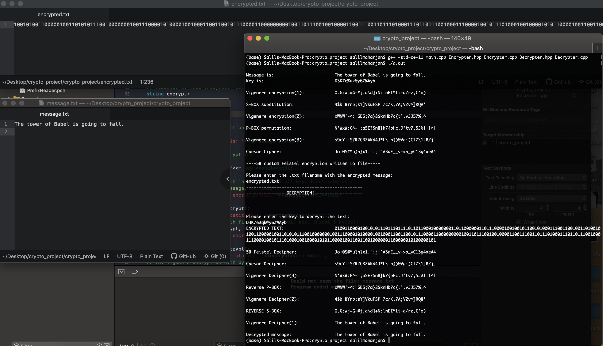
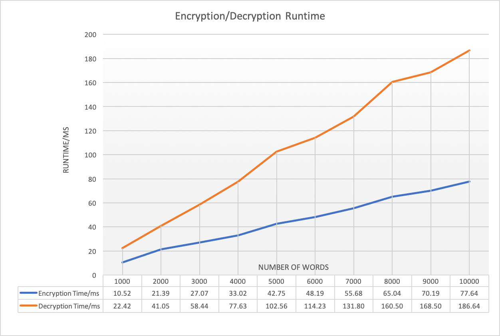
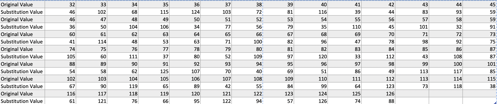

# CryptographyProject
5BF+ ENCRYPTION. (5 Block Feistel +)
... Salil Maharjan

***

This project designs and implements a fully functional symmetric encryption-decryption algorithm pair in *C++*. 
The user is able to generate a random 128-bit encryption key to encrypt and decrypt a text of any given length. 

The cipher methods implemented and incorporated in this project are:
1. Vigènere Cipher
2. Caesar's Cipher
3. Custom Substitution Box (S-BOX)
4. Custom Permutation Box (P-BOX)
5. Feistel Style cipher. (5-block Feistel style cipher inspired by the DES symmetric algorithm.)

The encryption-decryption pairs are developed to stay in the range of ASCII printable characters (32-126 DEC).

Doxygen generated documentation can be found in the documentation folder.

#### Quick Demo of the algorithm:

#### Runtime report of the algorithm:

#### Custom Substitution box (S-BOX):

