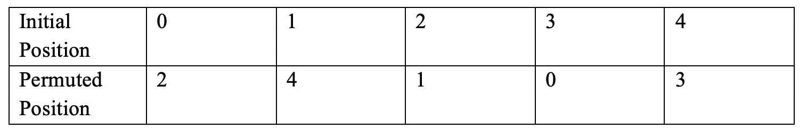
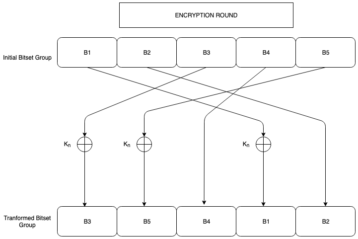
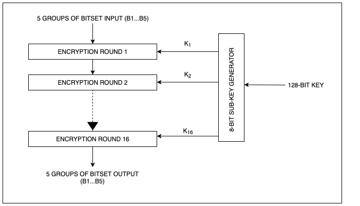
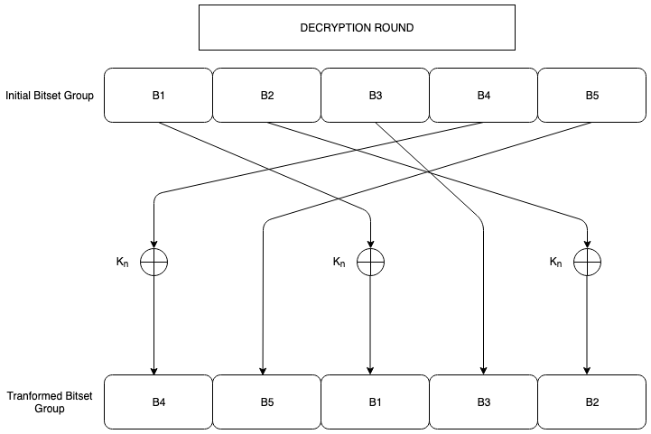
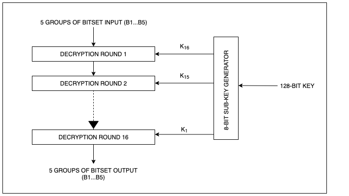

# CryptographyProject
5BF+ CIPHER ALGORITHM. 
(5 Block Feistel +)

***

This project designs and implements a fully functional symmetric encryption-decryption algorithm pair in **C++**. 

The user is able to generate a random 128-bit encryption key to encrypt and decrypt a text of any given length. 

The cipher methods implemented and incorporated in this project are:
1. Vigènere Cipher
2. Caesar's Cipher
3. Custom Substitution Box (S-BOX)
4. Custom Permutation Box (P-BOX)
5. Feistel Style cipher. (5-block Feistel style cipher inspired by the DES symmetric algorithm.)

The encryption-decryption pairs are developed to stay in the range of ASCII printable characters (32-126 DEC).

Doxygen generated documentation can be found in the documentation folder.

---

#### Quick Demo of the algorithm:
Running the program on message "The tower of Babel is going to fall."
Encryption and decryption output in each step of the algorithm shown on the console.

---

#### Runtime report of the algorithm:
Runtime of encryption and decryption pair in milliseconds on texts of length ranging from (1000-10,000) words.

---

#### Custom Substitution box (S-BOX):
Custom substitution box used in the algorithm.

---

#### Custom Permutation box (P-BOX):
Custom permutation box used.

---

#### 5-Block Feistel Style Encryption:
DES inspired 5-Block Feistel Style encryption.

---

#### 5-Block Feistel Style Decryption:
Decrypting the 5-Block Feistel generated cipher text.

---

For detailed description of the algorithm, visit: [Detailed report of 5BF+ Cipher](./ProjectReport.pdf)

***

